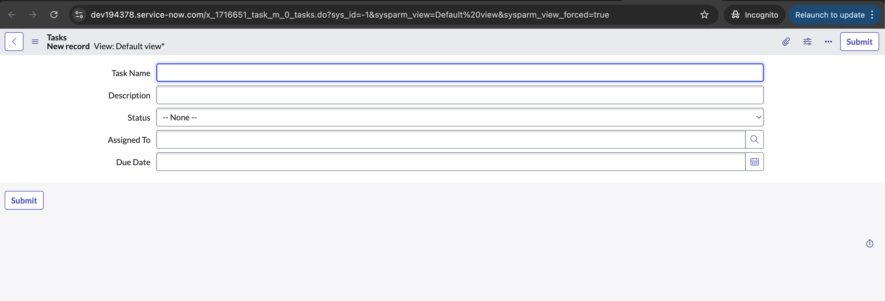
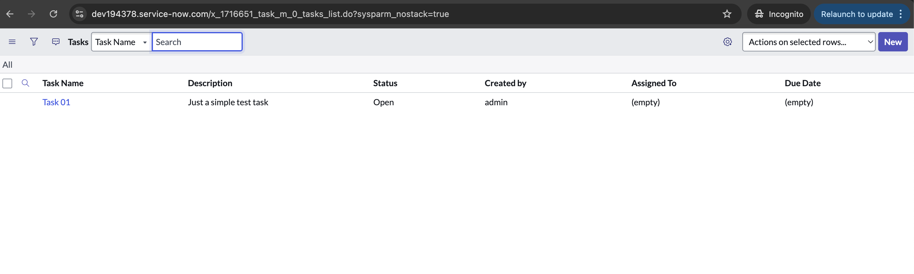
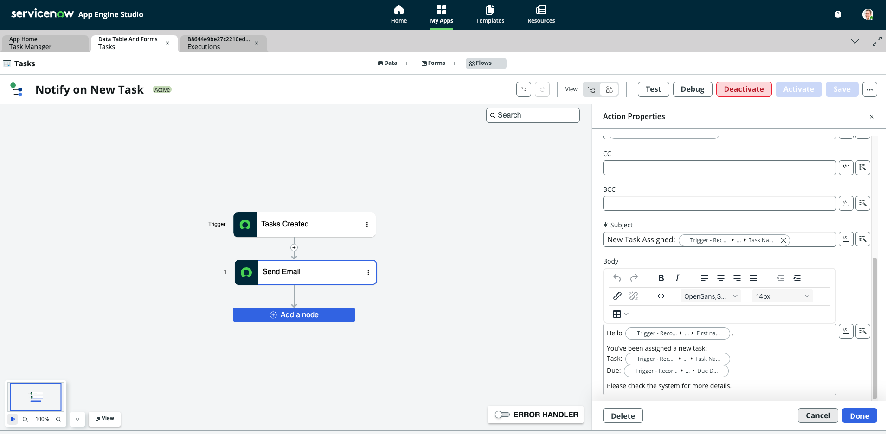
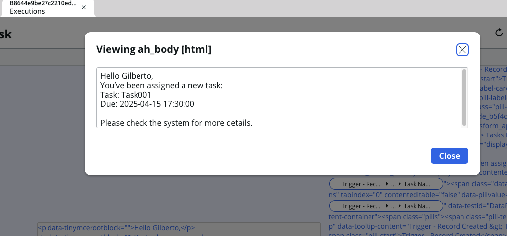

# 🛠️ ServiceNow Task Manager (Beginner App)

This is my first hands-on ServiceNow app, built entirely from scratch using a Personal Developer Instance (PDI).  
It’s part of my journey toward becoming a certified ServiceNow Developer, focused on mastering backend logic, automation, and platform fundamentals.

The project simulates a simple internal task management system, allowing me to explore core features such as form creation, field configuration, Flow Designer, and Business Rules.

---

## 📌 Key Features

- Custom table: `Tasks`
- Fields:
  - Task Name (String)
  - Description (String - full UTF-8)
  - Due Date (Date)
  - Status (Choice): Open, In Progress, Closed
  - Assigned To (Reference: User)
- Auto-generated form using App Engine Studio
- Custom list view with relevant fields

📸 Screenshots

| Form View | List View |
|-----------|-----------|
|  |  |

---

## ⚙️ Automations

### 🔁 Flow Designer – Email Notification

A flow was created using Flow Designer to send an email when a new task is created and assigned to a user.

- **Trigger:** Task created
- **Action:** Send Email to `Assigned To`

📸 Screenshot:

| Flow Designer | Email View |
|-----------|-----------|
|  |  |
 
---

## 🧪 Study Scripts

This project includes hands-on learning scripts to explore GlideRecord queries:

scripts/gliderecord-study.js

This script demonstrates:
- How to use addQuery(), addOrCondition(), and addEncodedQuery()
- How to retrieve a single record using get()
- How to handle reference fields like assigned_to using getDisplayValue() and getRefRecord()
- Best practices and performance considerations when querying data

It's fully commented to help reinforce key ServiceNow scripting concepts.

---

## 📚 What I learned

- How to navigate App Engine Studio and PDI
- Creating and managing custom tables and forms
- Working with field types: choice, reference, and multiline
- Setting up List Views for clarity and usability
- Creating flows with triggers and actions
- Understanding system email behavior in the PDI
- Using GlideRecord to query and manipulate records in scripts

---

## 🔧 Next Steps 
- Add Business Rules for field validation and status automation  
- Simulate external API integration using REST steps  
- Start working on a Scoped App version  
- Prepare for the Certified System Administrator (CSA) exam

---

## 👨🏻‍💻 About Me

I'm transitioning into the ServiceNow ecosystem with a strong focus on backend development, scripting, and platform automation.  
I document every step of my learning journey by building real applications in public and sharing insights with the community.

🫱🏽‍🫲🏻 [Let's connect on LinkedIn](https://www.linkedin.com/in/servicenow-developer-gilberto-silveira/)  

